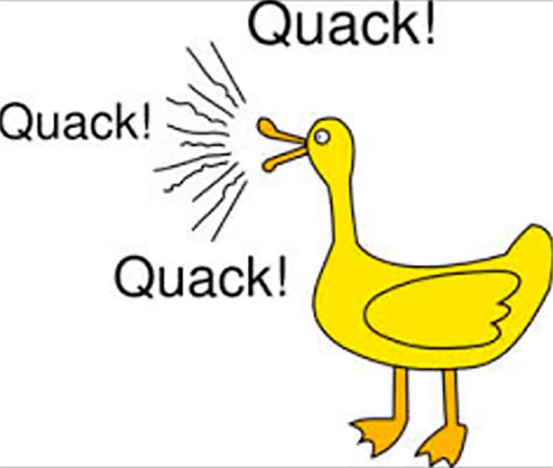

# q.u.a.c.k - Qlik Unsupported Api Checker King



Extractor to build a check list for removed or deprecated properties and methods.

App used: Monitor release - public APIs NEW - Sense
[https://branch.qlik.com/sense/app/557d299b-e557-45e3-9286-6b47bc189dd6](https://branch.qlik.com/sense/app/557d299b-e557-45e3-9286-6b47bc189dd6)

## Install

```npm install```

## Run Extractor

```node extractor```

## Extractor Results

**API Versions, ordered:** [/results/data/api-versions-data.json](/results/data/api-versions-data.json)

**API Items for Code Checker:** [/results/data/monitor-api-data.json](/results/data/monitor-api-data.json)

## Run Code Checker

```node codecheck <path-to-extension> <version>```

```node codecheck C:\Users\Win7\Documents\Qlik\Sense\Extensions\SenseUI-BarChart 2017113```

## Code Checker Results

```
q.u.a.c.k

Starting code check of extension: C:\Users\Win7\Documents\Qlik\Sense\Extensions\SenseUI-BarChart
against Qlik Sense version: 2018021 (February 2018 Patch 1)

process file: C:\Users\Win7\Documents\Qlik\Sense\Extensions\SenseUI-BarChart\senseui-barchart.js
process file: C:\Users\Win7\Documents\Qlik\Sense\Extensions\SenseUI-BarChart\lib\d3.v4.min.js
process file: C:\Users\Win7\Documents\Qlik\Sense\Extensions\SenseUI-BarChart\lib\SenseUI-barchart-options.js
Problem found at line: 7, column: 5
{
    "ComponentName": "EngineAPI",
    "ComparisonName": "Definitions",
    "Product_Version": "February 2018",
    "SortValue": 2018020,
    "Element": "OtherMode",
    "Status": "R",
    "Type": "property",
    "SearchMode": "EXACT",
    "Searches": [
        "qOtherMode"
    ]
}
process file: C:\Users\Win7\Documents\Qlik\Sense\Extensions\SenseUI-BarChart\lib\functions.js

Finished code check of extension: C:\Users\Win7\Documents\Qlik\Sense\Extensions\SenseUI-BarChart
Problems found: 1 occurances
```
